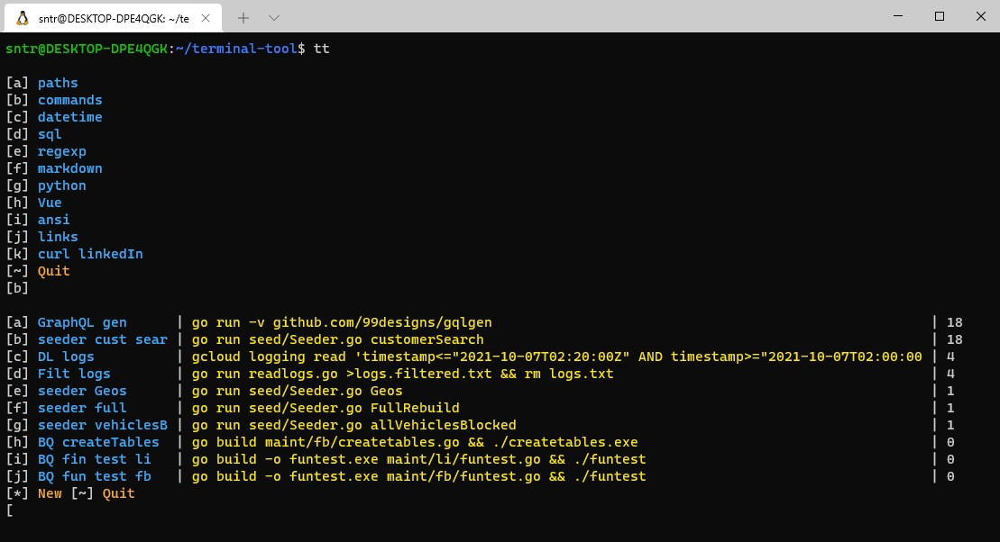

# Pasteback

With Pasteback you can store common terms and paste them back to clipboard
when needed.

There is one central spot to put every string into you need.
Either it's admin stuff like paths or commands or programmer's stuff
like build commands, sql or regex strings - if needed more than once or at
some time in the future: paste it back!  
You can even use it as a tiny wiki or a bookmark list. You can have 26x26
entries per instance.

## Setup (Windows Subsystem for Linux WSL)
- Copy the executable to your home/pasteback directory.
- Set an alias in .bashrc: `alias tt="/home/username/pasteback/pasteback"`.
- Now you can call pasteback from anywhere with `tt`.

## Usage (V0.8)
- Edit items.yml to add top menu items.
- Add new items to existing top menus with new (*): Enter a title and the
actual clipboard content will be added to items.yml.
- Quit with any key != letters and *.
- Items will be sorted according their usage count.